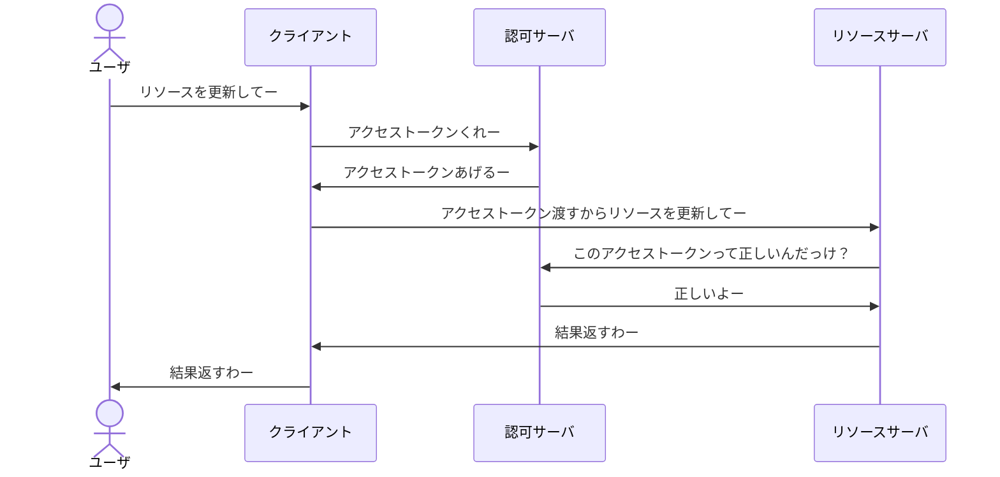
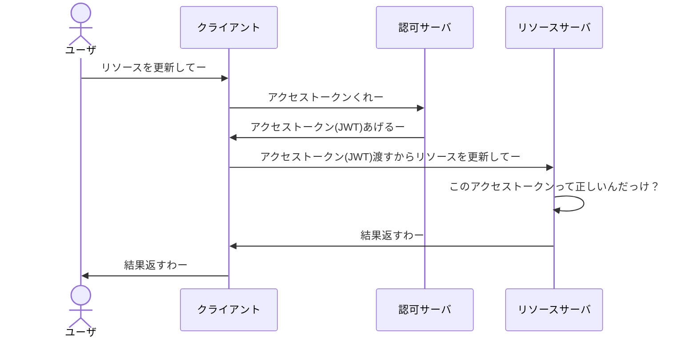
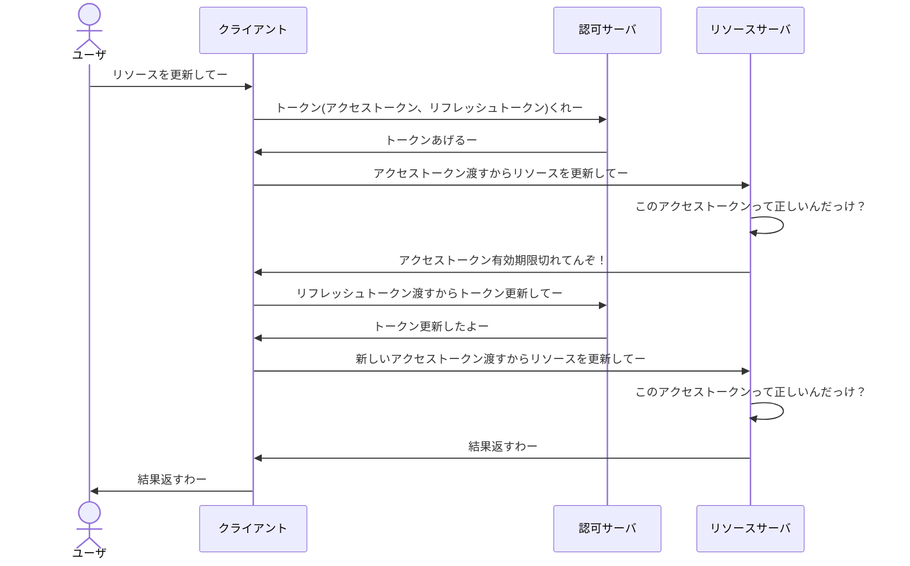

# Token
Tokenはざっくりいうと認可プロセスを実行するための情報をまとめたものになります。クライアントがこの情報を取得し、リソースサーバへアクセスするために利用されます。
# JWT
OAuth2のToken自体の形式は仕様化されていないので、よくJWT(JSON Web Token)を利用します。読み方はジョットです。
JSONとあるようにclaimと呼ばれる属性情報がJSONで表現されているTokenになります。
構成要素として以下のようなデータを含みます。
- issuer(発行元)
- subject(件名)
- audience(受信者)
- expiration time(有効期限)

詳しく知りたい方は以下を参照してください。

https://datatracker.ietf.org/doc/html/rfc7519#page-9
JSONということもあり、かなりシンプルな形ということでJWTはTokenの一般的なものの一つとなってます。また、他にも有用な場合がありますがそれは**Access Token**の章で後述します。
JWTはJWS(JSON Web Signature)やJWE(JSON Web Encryption)などの仕様と組み合わせると認可に必要な情報を提供するだけではなく、改ざんされなくなるような署名付きデータとして扱ったり(JWS)、データ解析されないように暗号化データとして扱うこと(JWE)ができます。二つを組み合わせることもなくはないですが一般的ではなかったりします。現状多いのはJWSを用いたJWTとなります。

JWSを用いたJWTのフォーマットは以下のようになります。
:::message
**<ヘッダー>.<ペイロード>.<署名>**
:::
- ヘッダー
署名アルゴリズムとトークンのタイプを定義します。
文字列の形式としては、キー名と値のペアで表現されたJSONをBase64URLエンコードした文字列となっています。
- ペイロード
JSON Web Tokenでやり取りするデータ本体です。ここにclaim情報が含まれています。
ヘッダーと同様に、JSONをBase64URLエンコードした文字列となっています。
- 署名
`ヘッダー`、`.`、`ペイロード`を連結した値を署名アルゴリズムで署名し、Base64URLエンコードすることにより作成されます。

こういう形式なのでヘッダーとペイロードに関しては、容易にデコードができます。
# Access Token
## 概要
Access Tokenはリソースに直接アクセスするために必要な情報を保持しています。クライアントがリソースサーバへAccess Tokenを渡すとリソースサーバはAccess Tokenに含まれている情報を利用してクライアントが認可できるか判断します。

以下が一般的なシーケンスになります。[^1]
[^1]: 前段に認証コードの発行プロセスがありますが今回は割愛します。

パッと見これで良さげなのですが、考慮しないといけない部分があります。
アクセストークンの検証部分です。
同一ドメイン(ネットワーク)内の場合ですと認可リソースにも直接アクセスできるため検証は容易なのですが、例えばこれが違うドメインの場合は直接アクセスすることが難しくなります。別ドメインへAPI接続等出来ますが、この接続に対しても認証認可を考える必要が出てくるため再帰的にめんどくさくなります。
その解決策の一つが**JWT**となります。

以下、JWTを利用した場合のシーケンスになります。

変わった部分はアクセストークンの検証部分です。先ほどは認可サーバへ問い合わせていましたが、この部分がリソースサーバで自己解決できるようになります。これは、JWSを用いたJWTで実現しています。
前章で話したようにJWTの署名部分はclaimなどから生成したものなので、JWTに含まれているヘッダーとペイロードをハッシュ計算した結果と署名を公開鍵で複合したハッシュ値が一致しているか確認できれば自分自身でトークンの正当性確認が可能というわけです。また、副次的効果として認可サーバへの問い合わせも減るので処理効率がアップします。
これがアクセストークンにJWTが利用されるもう一つの理由となります。

## 有効期限
Access Tokenは有効期限があり、有効期限は短く設定されるているのが一般的です。Access Tokenは頻繁にネットワークを流れるものなので悪者に盗聴される可能性があります。もしAccess Tokenが漏洩してしまっても、期限が短いので保護されたリソースへのアクセスリスクを低減できます。
# Refresh Token
## 概要
Refresh Tokenは新しいAccess Tokenを取得するために必要な情報を保持しています。Refresh Tokenの用途としてはAccess Tokenの期限が切れてしまった時に新たなAccess Tokenを取得するために利用されます。
普通に考えればAccess Tokenを通常フローに則って再取得すれば良いだけなので、Refresh Tokenなんて必要ないのでは？と思いますが、実運用を考えるとRefresh Tokenがあった方が便利になります。
Access Tokenの有効期限が短いため、頻繁に期限切れとなってしまい、アクセストークンの取得フローも頻繁に実行する必要があります。この記事で省いた部分にも色々と処理があるため、その部分がネックとなり、かなりユーザビリティが低下してしまうのです。そこで、Refresh Tokenを利用して煩わしい部分を回避するという理由のために存在します。

以下がRefresh Tokenを利用したシーケンスになります。

このように認可サーバへのRefresh Tokenを渡し、Access Tokenをリフレッシュしてもらうことで、リソースへのアクセスができるようになりました。これで有効期限の短いAccess Tokenを維持し、セキュリティも担保できます。

## 有効期限
Refresh Tokenにも有効期限がありますが、Access Tokenよりも長い時間が設定されます。Refresh TokenもAccess Tokenと同じリスクは抱えています。そのため、有効期限が長くて良いのか？と思いますが、Access Tokenと比較するとネットワークでやり取りする数が圧倒的に少なくなるので盗聴されるリスクは低くなります。そのレベル感で良いなら何も考慮する必要はないのですが、そのリスクも飲めないようなセキュリティ要件の高いシステムだとRefresh Tokenを漏洩しないように暗号化したり、認可サーバ側にブラックリスト的な仕組みを入れたり、セキュリティを高める仕組みを考える必要が出きてます。結果、Access TokenのセキュリティよりRefresh Tokenのセキュリティの方が考慮する点が多くなります。
#jwt #oauth2/refreshtoken 